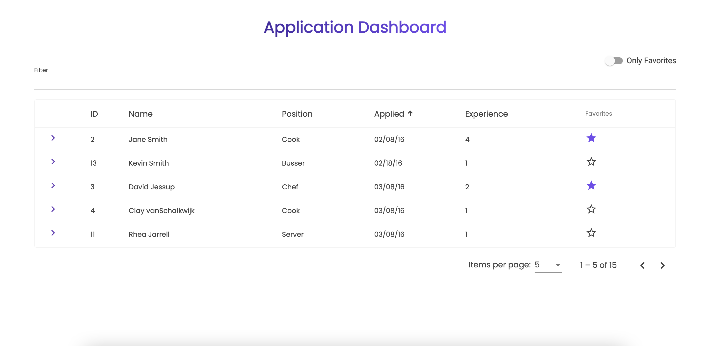
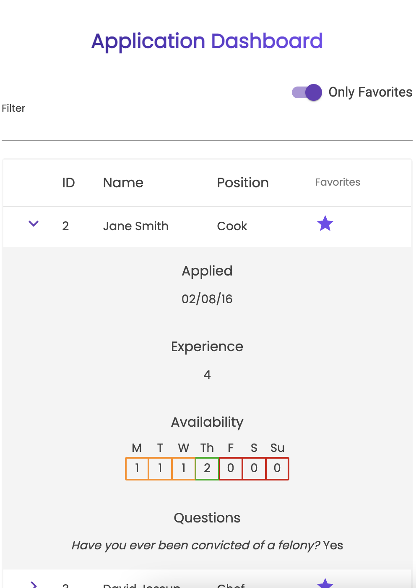
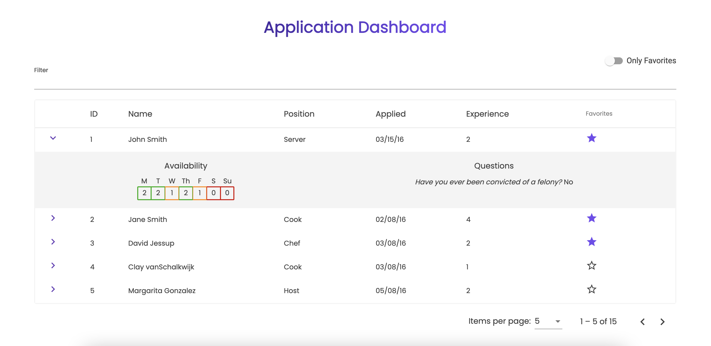
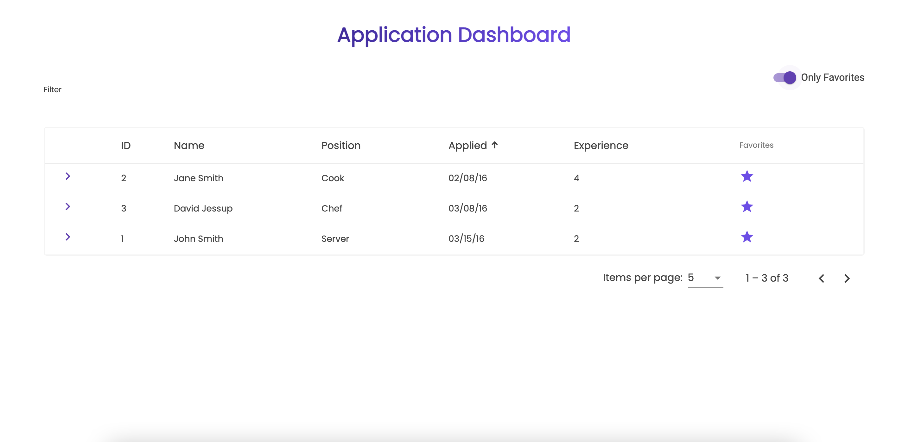

# APPLICATION DASHBOARD

## Table of Contents

- [About](#About)
- [UI](#UI)
- [Dependencies](#Dependencies)
- [Contact](#Contact)

## About

This application serves as a Job Applications Dashboard for a hiring manager. From the dashboard, a user can view a paginated table of all current job applications. From here a user can sort, filter, and favorite applications in the table and expand each row to reveal additional details.

See the deployed app [here](http://angular-applications-manager.s3-website-us-east-1.amazonaws.com/).

## UI

Desktop View with Sorted Column

## 

Mobile View

## 

Row Detail

## 

Favorites (persist in local storage)

## 

## Dependencies

- [Angular](https://angular.io/)
- [Angular Material](https://material.angular.io/)
- [Angular Material Table](https://material.angular.io/components/table/overview)
- [Angular Material Icon](https://material.angular.io/components/icon/overview)
- [Angular Material Tooltip](https://material.angular.io/components/tooltip/overview)
- [Angular Material Input](https://material.angular.io/components/input/overview)
- [Angular Material Slide Toggle](https://material.angular.io/components/slide-toggle/overview)

## Contact

### Danny Reyes

- [GitHub](https://github.com/reyesdmusic)
- [LinkedIn](https://www.linkedin.com/in/danny-reyes-dev/)
- email: vdannyreyesdev@gmail.com
